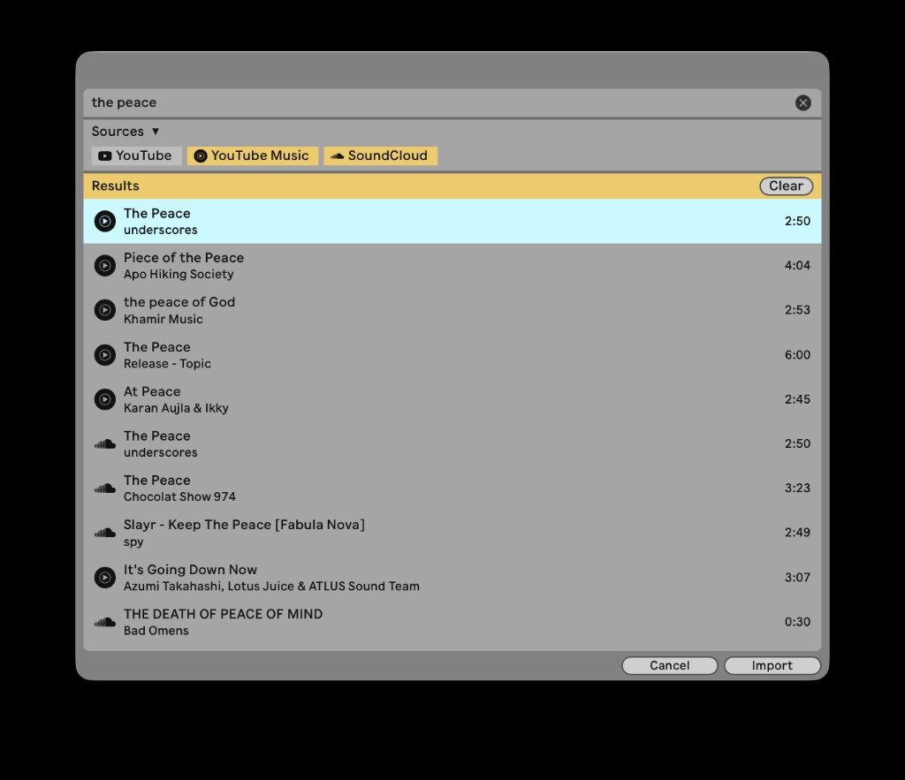
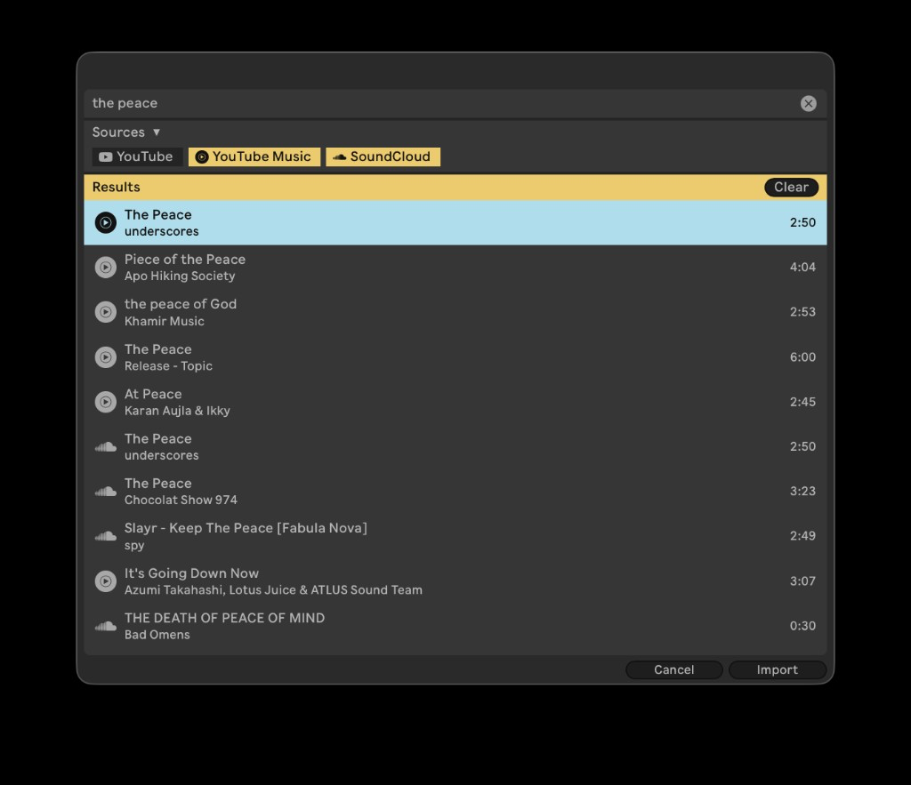

# Online Audio for Ableton Live

**Bring a reference, vocal, texture, or sample into your set without leaving Live.**

Online Audio searches YouTube, YouTube Music, and SoundCloud inside Ableton Live. Review the title, artist, source, and duration, then import your pick directly into a clip slot or Arrangement track.

<p align="center">
  <a href="../../releases/latest/download/Online-Audio.ablx"><strong>Download Online Audio (.ablx)</strong></a>
  ·
  <a href="../../releases/latest">Release notes</a>
</p>

> Requires the **[Ableton Live 12.4.5 public beta](https://ableton.github.io/extensions-sdk/)** with Extensions. The Extensions SDK is beta-only for now.

<p align="center">
  
  
</p>

## Get started

1. [Download the latest `.ablx`](../../releases/latest/download/Online-Audio.ablx).
2. Open the downloaded file and let Live install the extension.
3. Right-click a clip slot, an Arrangement selection, or an audio track.
4. Choose **Extensions → Online Audio: Import…**
5. Search for a song or paste a YouTube, YouTube Music, or SoundCloud URL.
6. Pick a result and select **Import**. Online Audio places it in your set.

## Stay in the flow

- **Search three sources at once.** Compare YouTube, YouTube Music, and SoundCloud results in one list.
- **Find the right version.** Results favor studio releases unless you ask for a live take, cover, remix, or another variation.
- **Bring your own link.** Paste a URL when you already know the exact audio you need.
- **Work from the keyboard.** Use <kbd>↑</kbd>/<kbd>↓</kbd> to move, <kbd>Enter</kbd> to import, and <kbd>Esc</kbd> to cancel. You can also double-click a result.
- **Skip system setup.** Online Audio needs no Homebrew or FFmpeg.

On the first import, Online Audio downloads a managed `yt-dlp` binary into Live's extension storage (about 35 MB). It checks for updates about once a day.

## Requirements

- [Ableton Live 12.4.5 public beta](https://ableton.github.io/extensions-sdk/) with Extensions (the Extensions SDK is beta-only for now)
- An internet connection

That is all musicians need. The Ableton Extensions SDK is required only for development.

## Use audio responsibly

Download only audio you have permission to use. Follow copyright law and each source's terms of service.

<details>
<summary><strong>Development and packaging</strong></summary>

### Set up

Get the Ableton Extensions SDK tarballs described in [`vendor/README.md`](vendor/README.md), then run:

```bash
npm install
cp .env.example .env
# Set EXTENSION_HOST_PATH in .env to your Live Beta application.
# In Live, enable Preferences → Extensions → Developer Mode.
npm start
```

### Build a package

```bash
npm run package
```

The package command produces a versioned `Online-Audio-<version>.ablx` file.

### Publish a download

Attach the build to a GitHub Release with the asset name `Online-Audio.ablx`. The download links at the top of this README always target that file in the latest release.

</details>

## Open source

The source code is available under the [MIT License](LICENSE). Ableton's proprietary SDK tarballs are not included and must not be redistributed.
